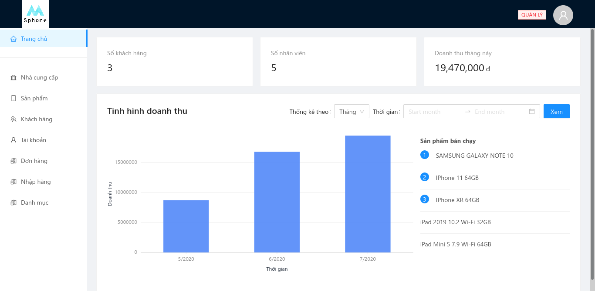

# Mobile store management
> This project is a project at university to manage a mobile store



## Getting Started

### Dependencies

- Node 12 or above
- yarn or npm for installing packages

### Installation

- Install dependencies: 

```sh
yarn install
```

- Change server URL in file src/services/http.js

- Run the backend project:

  You can find backend project source code & installation instruction here: [SphoneBackend](https://github.com/phamphuckhai/SPhoneBackEnd)

- Run the project:

```sh
yarn start
```

## Built With

- [Reactjs](https://reactjs.org/) - A JavaScript library for building user interfaces
- [Ant Desin](https://ant.design/docs/react/getting-started) - A component library for react
- [Redux](https://redux.js.org/) - A Predictable State Container for JS Apps
- [Redux Toolkit](https://redux-toolkit.js.org/) - The official, opinionated, batteries-included toolset for efficient Redux development

## Funtions

- Manage provider, customer, user, product, category
- Create order
- Simple statistic

## Demo

You can use find demo for this project here: [Demo](https://sphone.netlify.app/)

## Meta

Đào Mạnh Dũng –  daomanhdung@hotmail.com [Github](https://github.com/manhdung99)